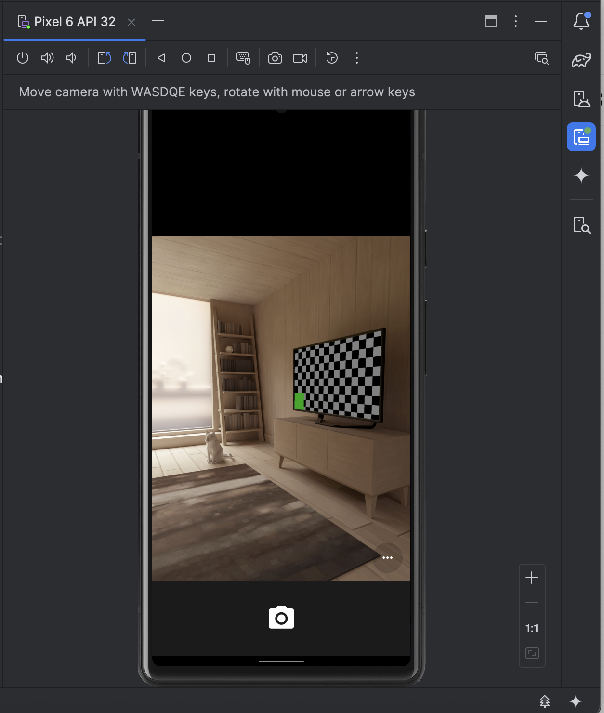
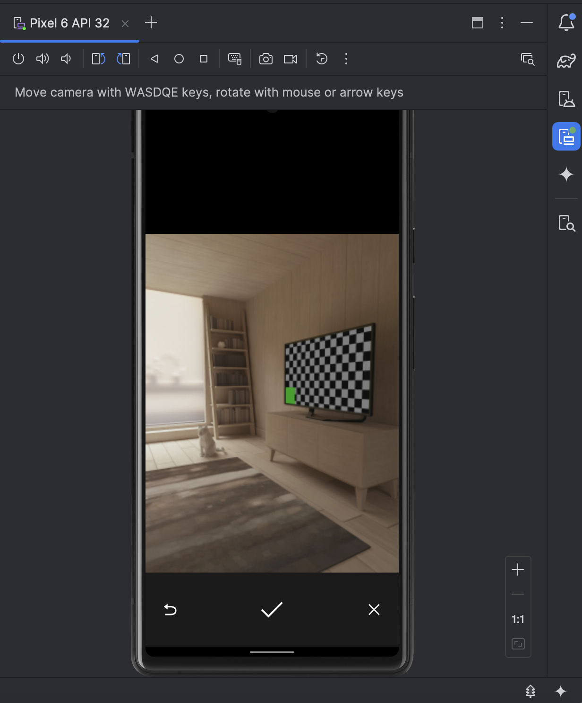
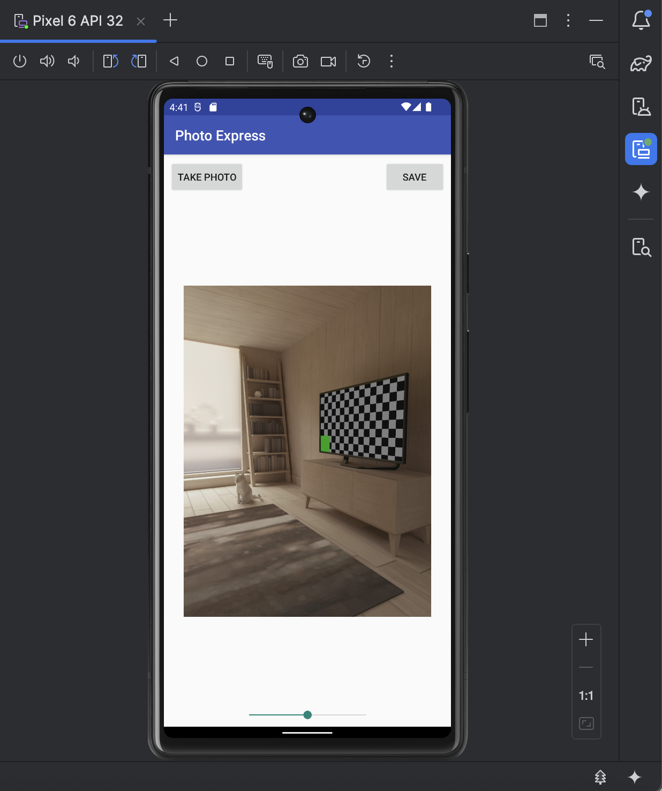
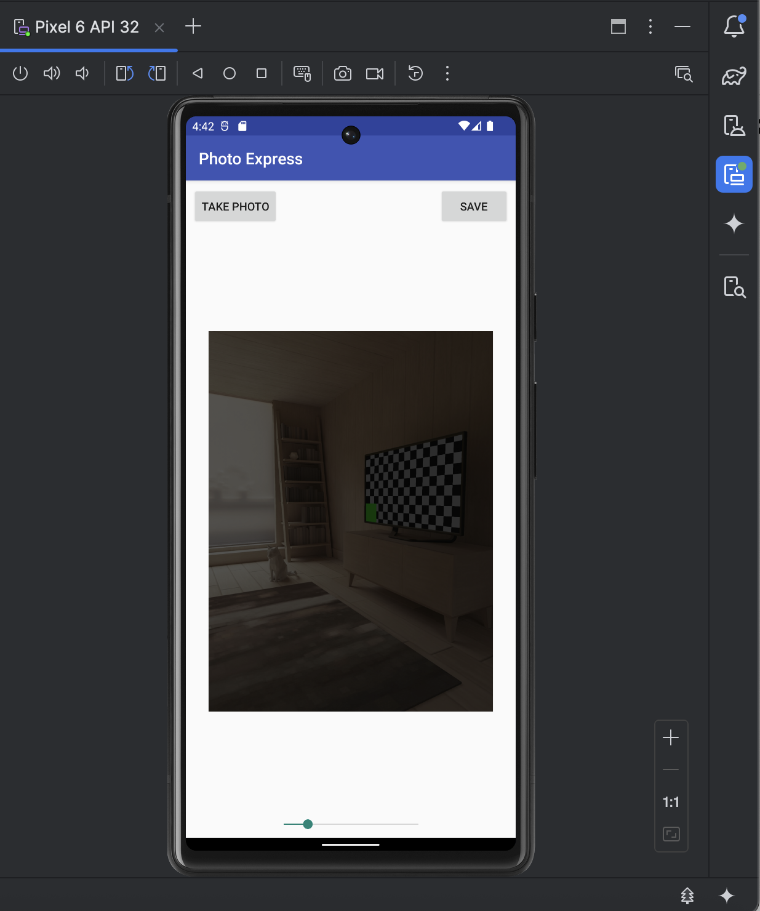
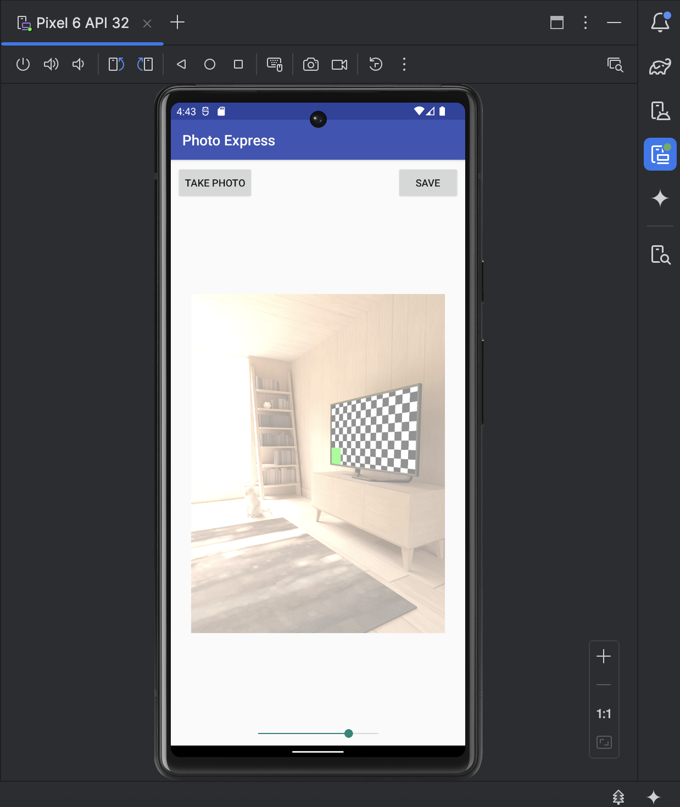
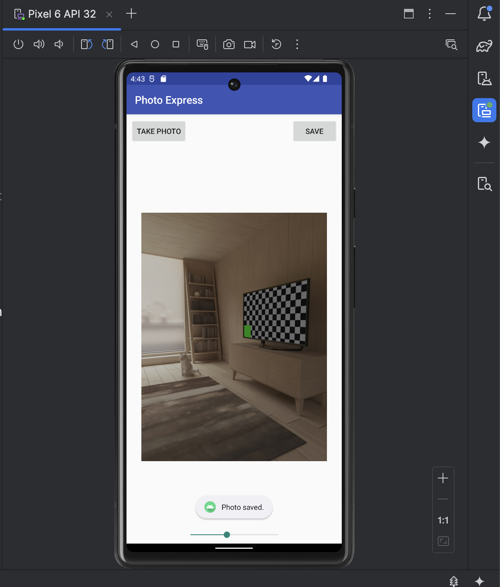

# 📸 Photo Express

Photo Express is a simple Android application that uses the device's built-in camera to take a photo, adjust its brightness, and save the modified version to shared storage. Other apps on the device can then access the saved image.  

This project demonstrates:
- Camera integration using `ActivityResultContracts.TakePicture`
- Real-time image brightness filtering
- Saving edited images to MediaStore
- Basic use of Android UI components (`ImageView`, `SeekBar`, `Button`)

---

## ✨ Features

### 📷 Take a Photo  
The app launches the built-in camera, allowing the user to capture an image.

### 🌗 Adjust Brightness  
A slider (SeekBar) appears after taking a photo, enabling:
- Darkening the image  
- Brightening the image  

Brightness adjustments are applied in real time using a `LightingColorFilter`.

### 💾 Save Edited Photo  
The edited photo is saved to:
- App-specific storage  
- Public **Pictures** folder (on Android 10+)

A “Photo saved” confirmation appears when the operation completes successfully.

---

## 🖼️ Screenshots

### 1. Initial screen  

### 2. Camera launched  

### 3. Photo taken — preview screen  

### 4. Confirming the captured photo  

### 5. Darkened image (brightness slider moved left)  

### 6. Brightened image (brightness slider moved right)  

### 7. Image successfully saved  

> 📌 Place your screenshot files in a `screenshots` folder inside your repo to make these links work.

---

## 🧠 How It Works

### **MainActivity.kt**  
The entire app logic is implemented in one file:

- Launches camera using `TakePicture()`
- Saves the captured image to a file
- Displays the image scaled to the `ImageView`
- Applies brightness adjustments by updating `multColor` and `addColor`
- Creates a new bitmap and saves the altered version using a coroutine on the IO dispatcher
- Inserts the saved photo into the system’s MediaStore so other apps can access it

---
